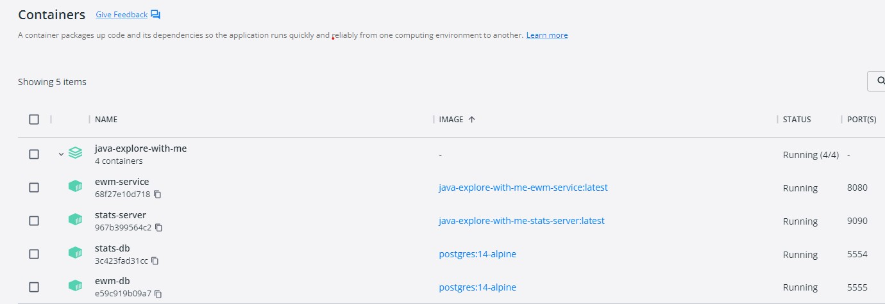

# java-explore-with-me 

## Graduate work "Explore-With-Me" providing API for managing events 

## Project description
Application provides basic event management functionality. Events publication, registration of participants for event and search for events.
There are three roles: admin, user and public. Authorization and role management are out of scope of the project.
*Admin* can create event categories, places of interest, new users, perform moderation of new events, create and delete event compilations
*Users* can create events, register for events of other users, confirm or reject event participation requests from other users
*Public* can search for events using different criterias such as key words, date range, location, categories. Get detailed information on specific event. Each search for list of events or for particular events stores in the statistics service and could be retrieved using API. Number of veiws for the particular event is shown in the event detailed info. 

## Technologies
* Java 11
* Docker
* Spring Boot
* Lombok
* PostgreSQL 14
* Maven 3.8.4

## Launch

This application configured to run in a local Docker Container. Docker Desktop https://www.docker.com/products/docker-desktop/ may be used as an option for running  applications locally.

### In order to launch Explore-With-Me service:
* Clone the whole application from github
* Start your local Docker runtime environment
* Open command-line shell and move to application root folder (java-explore-with-me).
* Run `docker compose up` command
* Check that containers `ewm-service`, `stats-service`, `stats-db` and `ewm-db` are up and running inside Docker

## Usage

There are two sample collections inside `postman` folder of this project. These collections cover all usage scenarious:

`Test_Explore_With_Me.json` and `ewm_main_service_with_places.json`

* Download and open postman application https://www.postman.com/downloads/
* Import above collections from files
* Collection could be run at whole or each separate test can be run separately 

